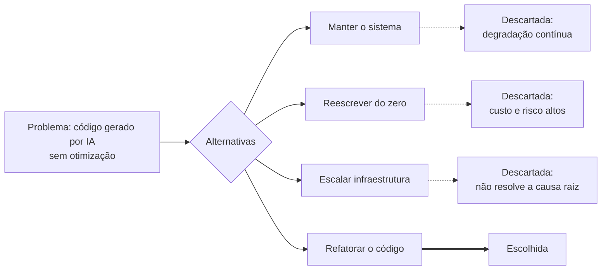

# Aula 01 — Refatoração do Código Legado

Esta aula tratou de um cenário de código gerado por IA, sem revisão técnica, que apresentava baixa qualidade, duplicação de lógica de acesso ao banco e problemas de desempenho conforme a base de usuários cresceu.

## Conteúdo

| Documento | Descrição |
|---|---|
| [`ADR-0001.md`](ADR-0001.md) | Decisão de refatorar o código-fonte em vez de reescrevê-lo do zero ou apenas escalar infraestrutura |

## Resumo da decisão

A equipe optou por **refatorar** o sistema existente, focando em:
- Otimização de consultas ao banco de dados
- Reestruturação de trechos de alta complexidade/duplicação
- Aplicação de boas práticas e padrões de projeto
- Organização do código para facilitar manutenção futura

Detalhes completos — contexto, alternativas descartadas e consequências — estão no [ADR-0001](ADR-0001.md).