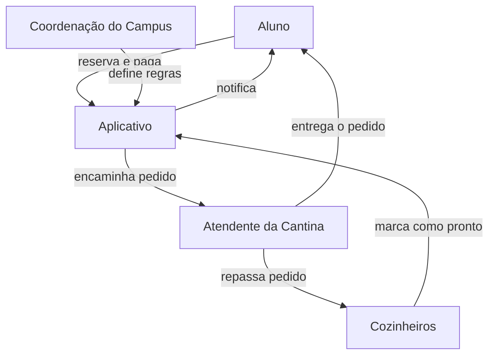
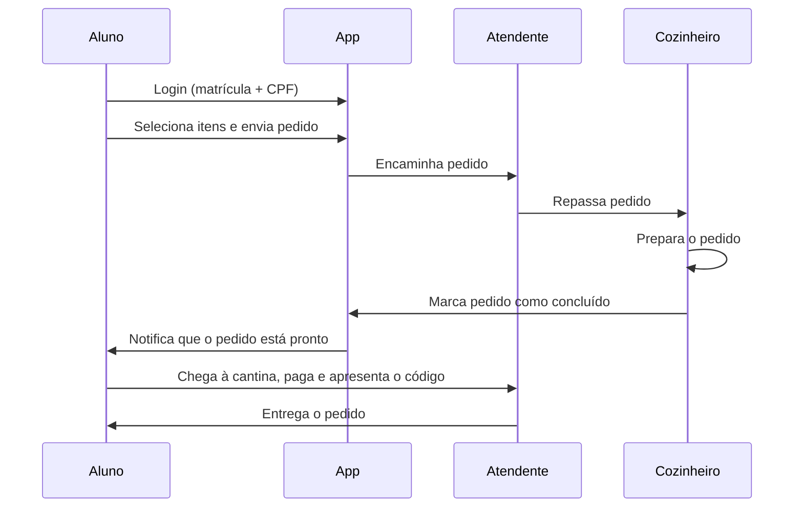

# Aula 02 — Aplicativo para Reduzir Filas da Cantina

Esta aula tratou do desenho de um aplicativo para que alunos façam pedidos antecipados na cantina do campus, reduzindo as filas no horário de almoço.

## Conteúdo

| Documento | Descrição |
|---|---|
| [`ADR-0002.md`](ADR-0002.md) | Decisão de arquitetura: app mobile com login por matrícula/CPF, pedido antecipado e pagamento presencial |
| [`mapa-contexto-0002.md`](mapa-contexto-0002.md) | Mapa de contexto: envolvidos, limitações e pontos ainda em aberto |

## Envolvidos

## Fluxo do pedido

## Pontos ainda em aberto

- Se o pagamento será feito pelo app ou presencialmente
- Como tratar pedidos reservados e não retirados
- Se haverá cobrança/penalidade para pedidos abandonados

Detalhes completos das alternativas consideradas (pagamento pelo app, agendamento de horário) e das consequências estão no [ADR-0002](ADR-0002.md).