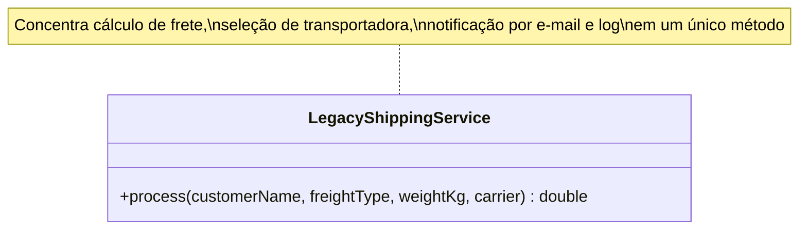
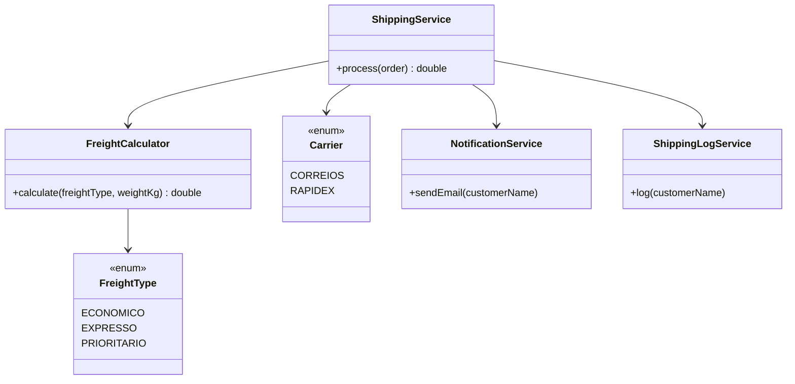

# Aula 03 — Correção de Problemas de Estruturação

Esta aula analisou um trecho de código legado (`LegacyShippingService`) em busca de problemas de design — baixa coesão, acoplamento, uso excessivo de `if/else` e duplicação de lógica — e propôs uma reestruturação.

## Conteúdo

| Documento | Descrição |
|---|---|
| [`ADR-0003.md`](ADR-0003.md) | Análise dos problemas encontrados e decisão de reestruturação |
| [`codigoComentado.java`](codigoComentado.java) | Código original com anotações apontando os pontos de melhoria |

## Problemas identificados

| # | Problema | Evidência |
|---|---|---|
| 1 | Baixa coesão / responsabilidade única violada | `process()` calcula frete, identifica transportadora, envia e-mail e grava log |
| 2 | Acoplamento | Regras de frete, transportadora, notificação e log misturadas no mesmo método |
| 3 | Excesso de `if/else` | Comparações de `String` para tipo de frete e transportadora |
| 4 | Duplicação/dispersão de lógica | Verificações de frete e transportadora não centralizadas |

## Estrutura atual vs. proposta

## Decisão

Substituir os `if/else` por `Enum` (para tipos de frete e transportadoras) e separar cada responsabilidade — cálculo de frete, notificação, log — em componentes próprios, deixando o serviço principal apenas como coordenador do fluxo.

Detalhes completos — causas, impactos, alternativas descartadas e consequências — estão no [ADR-0003](ADR-0003.md).