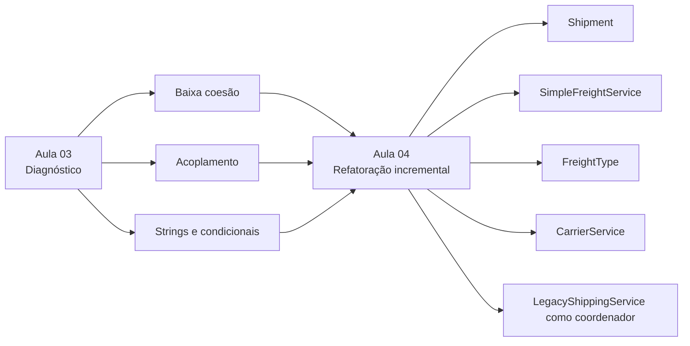

# ADR-0004: Resolução dos problemas estruturais

## Status
Aceito

## Problema Analisado

Na Aula 03, a classe `LegacyShippingService` foi identificada como um ponto de concentração de responsabilidades. O método `process` participava de diferentes etapas do envio, incluindo cálculo de frete, encaminhamento para a transportadora, notificação e registro de informações.

A primeira etapa de refatoração foi feita de forma incremental, sem reescrever o legado por completo. O objetivo foi retirar responsabilidades que poderiam ser representadas por componentes próprios e manter o `LegacyShippingService` como coordenador do fluxo.

### 1. Dados do envio concentrados no fluxo principal

O fluxo precisava receber e transportar separadamente informações como identificador, nome do cliente e peso.

**Decisão:** criar o `record` `Shipment` para representar os dados do envio em um único objeto.

O `Shipment` também passou a validar suas invariantes no construtor compacto:

- `id` não pode ser nulo ou vazio;
- `customerName` não pode ser nulo ou vazio;
- `weightKg` deve ser maior que zero.

**Impacto:** o objeto de domínio já é criado em um estado válido, evitando que dados inválidos avancem pelo fluxo.

### 2. Cálculo do frete acoplado ao serviço legado

A regra de cálculo do frete pertencia ao fluxo de envio, mas não precisava permanecer implementada diretamente no `LegacyShippingService`.

**Decisão:** extrair essa responsabilidade para `SimpleFreightService`.

O novo serviço recebe um `Shipment` e um `FreightType` e realiza o cálculo usando os valores definidos no `enum`.

**Impacto:** alterações na fórmula ou nas regras de cálculo podem ser feitas sem concentrar novamente a mudança no serviço legado.

### 3. Representação dos tipos de frete por valores fixos

Na implementação analisada na Aula 03, os tipos de frete eram tratados por comparações de `String` dentro do fluxo principal.

**Decisão:** utilizar o `enum` `FreightType`, com as opções `ECONOMICO`, `EXPRESSO` e `PRIORITARIO`, cada uma contendo seus respectivos valores fixos e variáveis.

**Impacto:** a aplicação passa a trabalhar com um conjunto fechado e tipado de opções de frete, reduzindo erros de digitação e deixando as regras de preço próximas ao conceito que elas representam.

### 4. Integração com a transportadora fora do cálculo do frete

O envio para a transportadora também não deve ser misturado à regra de cálculo.

**Decisão:** manter essa responsabilidade em `CarrierService`, que recebe um `Shipment` e um `Carrier` e direciona a chamada para a integração correspondente.

**Impacto:** cálculo de frete e envio para a transportadora passam a ter responsabilidades separadas.

## Decisão

Para corrigir os principais problemas estruturais identificados na Aula 03, decidimos realizar uma **refatoração incremental** do legado, com as seguintes mudanças efetivamente apresentadas no código:

1. **Criar `Shipment` como `record` de domínio**
    - Agrupa `id`, `customerName` e `weightKg`.
    - Mantém os dados imutáveis.
    - Valida as invariantes no momento da criação.

2. **Extrair o cálculo para `SimpleFreightService`**
    - O método `calculate` passa a concentrar a fórmula do frete.
    - O `LegacyShippingService` apenas solicita o cálculo ao componente especializado.

3. **Adotar `FreightType` como enum**
    - Representa `ECONOMICO`, `EXPRESSO` e `PRIORITARIO`.
    - Guarda os valores de preço fixo e variável utilizados no cálculo.
    - Evita o uso de strings soltas para representar modalidades de frete.

4. **Manter `CarrierService` como componente responsável pelo encaminhamento à transportadora**
    - Recebe o `Shipment` e o `Carrier`.
    - Direciona a operação para a integração de `Correios` ou `Rapidex`.

5. **Transformar `LegacyShippingService` em coordenador do processo**
    - O construtor recebe `SimpleFreightService` e `CarrierService`.
    - O método `process` coordena o fluxo, delegando responsabilidades específicas.

> Observação: a classe `NotificationService` já está presente no projeto como etapa de separação da responsabilidade de notificação. Porém, nesta versão do `LegacyShippingService`, o fluxo ainda contém os `System.out.println` de notificação e log. Portanto, a decisão desta ADR não considera que a integração da notificação já esteja concluída.

## Alternativas Consideradas

### 1. Reescrita completa do serviço legado

**Descrição:** criar um serviço novo do zero e abandonar imediatamente o `LegacyShippingService`.

**Prós:** permitiria reorganizar toda a estrutura de uma vez.

**Contras:** maior risco de alterar comportamentos existentes, maior esforço de implementação e dificuldade para validar se nenhuma regra do legado foi perdida.

**Motivo da rejeição:** preferimos evoluir o sistema por etapas, preservando o fluxo existente e reduzindo o risco da mudança.

### 2. Apenas dividir o método `process` em métodos privados

**Descrição:** manter tudo dentro do `LegacyShippingService`, apenas quebrando o método em funções menores.

**Prós:** poucas alterações estruturais.

**Contras:** a classe continuaria concentrando várias responsabilidades e permaneceria difícil de testar e evoluir de forma independente.

**Motivo da rejeição:** melhora a leitura, mas não resolve a causa principal do problema apontado na Aula 03.

### 3. Manter `String` para representar os tipos de frete

**Descrição:** continuar tratando `ECONOMICO`, `EXPRESSO` e `PRIORITARIO` por comparações de `String`.

**Prós:** implementação simples e compatível com o código inicial.

**Contras:** possibilidade de erro de digitação e regras espalhadas por condicionais.

**Motivo da rejeição:** o `enum` `FreightType` fornece tipagem mais forte e concentra os valores associados a cada modalidade.

### 4. Criar `Shipment` como classe tradicional com getters e setters

**Descrição:** utilizar uma classe Java convencional para representar os dados do envio.

**Prós:** solução familiar e flexível para estados mutáveis.

**Contras:** mais código e possibilidade de alteração indevida do estado do objeto.

**Motivo da rejeição:** o `record` atende melhor ao papel de objeto de dados imutável utilizado nessa etapa do domínio.

## Consequências

### Vantagens

- **Maior coesão:** cálculo, representação do envio e integração com transportadoras ficam em componentes distintos.
- **Menor acoplamento no fluxo principal:** `LegacyShippingService` deixa de conhecer os detalhes da fórmula de cálculo.
- **Validação antecipada:** `Shipment` impede a criação de dados inválidos.
- **Tipagem forte:** `FreightType` reduz a dependência de strings livres.
- **Melhor testabilidade:** `SimpleFreightService` pode ser testado separadamente do fluxo de envio.
- **Refatoração incremental:** a estrutura pode continuar evoluindo sem exigir uma reescrita completa do sistema.

### Desvantagens

- **Maior quantidade de classes:** a separação de responsabilidades aumenta a quantidade de componentes.
- **Custo inicial de refatoração:** é necessário alterar construtores, parâmetros e fluxo de chamadas.
- **Estado intermediário do legado:** parte da notificação e do log ainda permanece no serviço principal e poderá ser extraída posteriormente.
- **Maior necessidade de organização:** as novas responsabilidades precisam permanecer bem distribuídas entre `domain`, `service`, `integration` e `legacy`.

## Relação com a Aula 03

A Aula 03 identificou os problemas. A Aula 04 aplica a primeira correção estrutural:

## Autor(es)

- João Paulo Marques Ferreira
- Gilvan Pedro de Castro Melo Campos
- Guilherme Scarcela Bueno
- Sidney Emanuel Barbosa
- Pedro da Mata Santos
- Giovanna Alice

Data: [18/08/2026]
