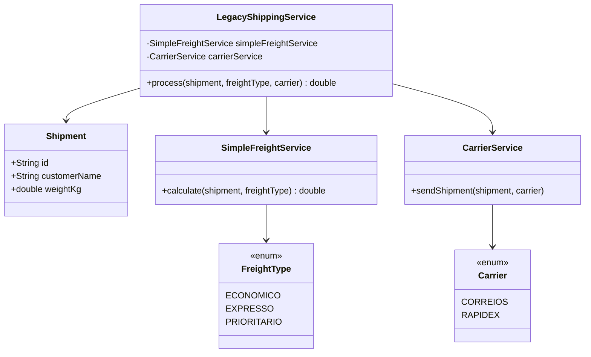
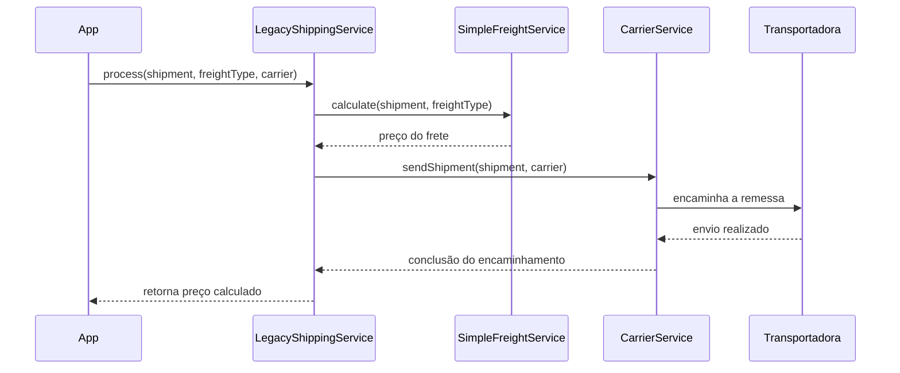

# Aula 04 — Refatoração das Responsabilidades do Serviço de Envio

Esta aula deu continuidade à análise da classe legada `LegacyShippingService`, aplicando na prática a separação das responsabilidades identificadas na aula anterior. O foco foi retirar do serviço principal as regras de cálculo do frete e de encaminhamento para a transportadora, além de melhorar a representação dos dados da remessa e dos tipos de frete.

## Conteúdo

| Documento | Descrição |
|---|---|
| [`ADR-0004.md`](ADR-0004.md) | Decisão de refatoração e organização das responsabilidades do serviço legado |
| [`CodigoComentado.java`](CodigoComentado.java) | Código de apoio com os pontos da implementação e das alterações realizadas |

## Problemas tratados

| # | Problema | Solução aplicada |
|---|---|---|
| 1 | `LegacyShippingService` concentrava diferentes responsabilidades | Delegação do cálculo para `SimpleFreightService` e do envio para `CarrierService` |
| 2 | Dados da remessa ficavam sem uma representação específica | Criação do `Shipment` como `record`, com validação dos dados recebidos |
| 3 | Tipos de frete eram representados por valores soltos | Uso do `FreightType` como `enum`, centralizando as regras de preço |
| 4 | Código principal dependia diretamente das regras de cada transportadora | Uso do `CarrierService` para encaminhar a remessa conforme a transportadora escolhida |

## Estrutura da solução

## Fluxo do envio

## Principais mudanças no código

### `Shipment`

A remessa passou a ser representada por um `record`, reunindo `id`, nome do cliente e peso em uma estrutura simples e imutável. O construtor também valida os dados obrigatórios para evitar a criação de uma remessa inválida.

### `SimpleFreightService`

A responsabilidade pelo cálculo do frete foi retirada do fluxo principal e concentrada em uma classe própria. A fórmula utiliza os valores definidos em `FreightType`, evitando espalhar as regras de cálculo pela aplicação.

### `FreightType`

O tipo de frete passou a ser representado por um `enum`, com as modalidades `ECONOMICO`, `EXPRESSO` e `PRIORITARIO`. Cada modalidade mantém seus valores utilizados no cálculo do preço.

### `CarrierService`

O encaminhamento para a transportadora foi separado do serviço legado. O `CarrierService` recebe a transportadora escolhida e direciona a remessa para o cliente correspondente, como `CorreiosClient` ou `RapidexClient`.

### `LegacyShippingService`

O serviço principal passa a atuar principalmente como coordenador do fluxo: recebe a remessa, solicita o cálculo do frete e solicita o encaminhamento da remessa. Dessa forma, deixa de concentrar diretamente as regras de cálculo e seleção da transportadora.

## Decisão

A equipe optou por realizar uma **refatoração incremental**, mantendo a classe `LegacyShippingService` e extraindo responsabilidades para componentes menores. A escolha busca melhorar coesão, reduzir acoplamento e facilitar a manutenção sem reescrever todo o sistema.

Detalhes completos — contexto, decisão, alternativas consideradas, vantagens e desvantagens — estão no [ADR-0004](ADR-0004.md).
