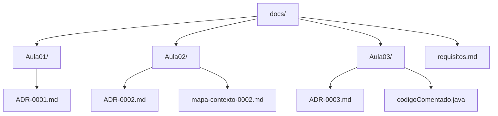

# Documentação

Esta pasta reúne toda a documentação técnica produzida ao longo das aulas: decisões de arquitetura (ADRs), mapas de contexto e análises de código. O objetivo é manter esse conhecimento centralizado e fácil de encontrar — tanto para quem já acompanha o projeto quanto para quem está chegando agora.

## Estrutura

| Pasta / Arquivo | Conteúdo |
|---|---|
| [`Aula01/`](Aula01/README.md) | ADR-0001 — refatoração do código legado |
| [`Aula02/`](Aula02/README.md) | ADR-0002 — aplicativo para reduzir filas da cantina + mapa de contexto |
| [`Aula03/`](Aula03/README.md) | ADR-0003 — correção de problemas de estruturação + código comentado |
| `requisitos.md` | Requisitos do projeto (documento ainda vazio, a ser preenchido) |

## Como usar

Cada pasta `AulaXX/` corresponde a uma aula e reúne os artefatos produzidos nela (em geral, um ADR e seus documentos de apoio). Antes de criar um novo documento, verifique se ele já não se encaixa em uma aula existente. Cada subpasta tem seu próprio `README.md` com um resumo do que foi decidido e links para os documentos completos.

## Convenções

- **ADRs** seguem o padrão `ADR-000X.md` (Status, Contexto, Decisão, Alternativas Consideradas, Consequências, Autores e Data).
- Documentos de apoio (mapas de contexto, código comentado etc.) ficam na mesma pasta da aula a que se referem e são linkados a partir do ADR correspondente.